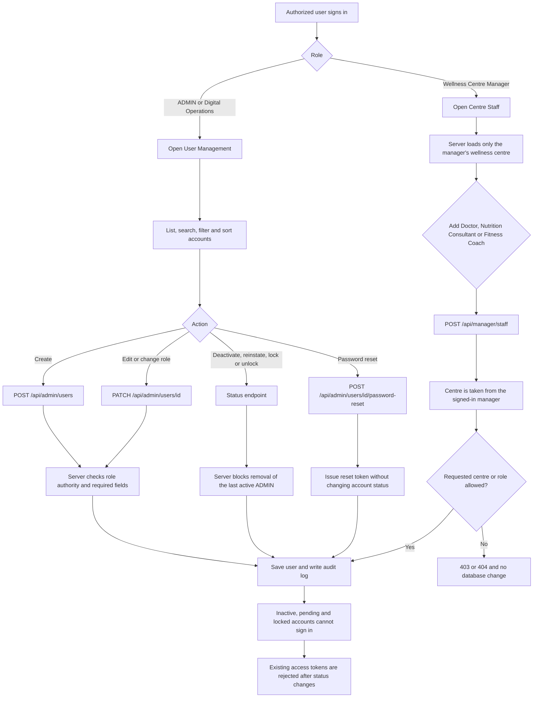

# User Management, Admin Dashboard and Centre Staff

This is the implemented flow for platform user management, the admin dashboard metrics, and wellness-centre staff management. Customer Support keeps its existing ticket workflow and is only read by the dashboard when counting tickets that are not Resolved or Closed.

## Activity diagram

## Account status

The stored statuses are `ACTIVE`, `INACTIVE`, `LOCKED` and `PENDING`.

- Inactive is the administrative suspension. The account cannot sign in, and a password reset does not make it active again.
- Locked is an administrative lock until an authorized unlock. It is separate from the temporary lock created by repeated failed sign-ins.
- Password reset never changes `INACTIVE`, `PENDING` or `LOCKED` back to `ACTIVE`.

## Ownership

A wellness centre is a `wellness_centres` row. Users point at it with `users.wellness_centre_id`. A manager can create and edit Medical Advisor, Nutrition Consultant and Fitness Coach accounts only for that centre. The request cannot choose another centre. Platform administrators assign a centre by id or name when they create an account.

## Dashboard metrics

`GET /api/admin/dashboard` returns `metrics` calculated from the database:

- total non-deleted users
- active staff, meaning active accounts whose role is not Client
- inactive and locked accounts
- sum of failed login attempts
- users created since the start of the current UTC month
- tickets whose status is Open, Assigned, In Progress, Pending Client Reply or Escalated
- user counts grouped by role

## Not implemented

Backup execution is not part of this module. The dashboard does not report a successful backup. Mail delivery for password reset is issued as a token and is emailed only when the existing mail configuration sends it.
